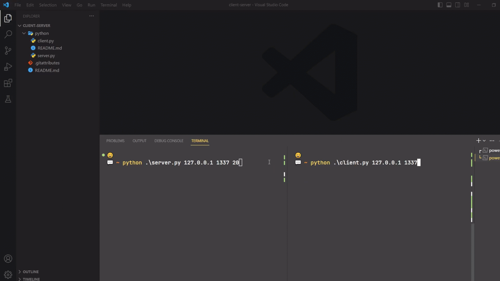

# [VI] Đây là mô hình Client-Server được dùng để tính toán các biểu thức
Cách sử dụng:
- Tải 2 file (*client.py* và *server.py*) này về hoặc copy.
- Chạy server bằng lệnh: 
            **python server.py <ip-server> <port-server> <clients>**
    Ví dụ nếu bạn muốn chạy trên địa chỉ 127.0.0.1 và trên cổng 2132 và cho phép 20 máy khách kết nối đến:
            **python server.py 127.0.0.1 2132 20**
- Mở một terminal (hay cmd) và Chạy các máy khách bằng lệnh: **python client.py <ip-server> <port>**

# [EN] This is the Client-Server model used to compute expressions
Usage:
- Download these 2 files (*client.py* and *server.py*) or copy.
- Run the server with the command: **python server.py <ip-server> <port-server> <clients>**
    For example if you want to run on address 127.0.0.1 and on port 2132 and allow 20 clients to connect to:
             **python server.py 127.0.0.1 2132 20**
- Open a terminal (or cmd) and Run the clients with the command: **python client.py <ip-server> <port>**

# Example / Ví dụ

